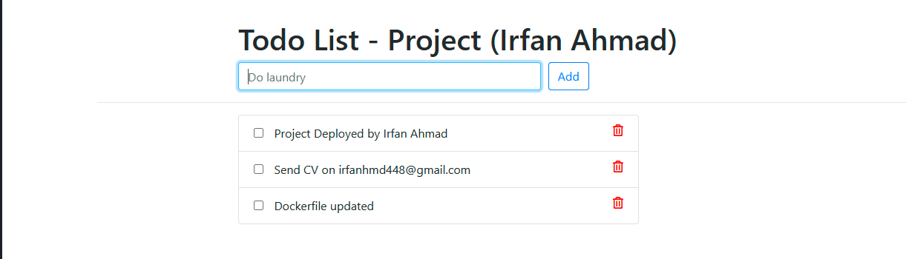
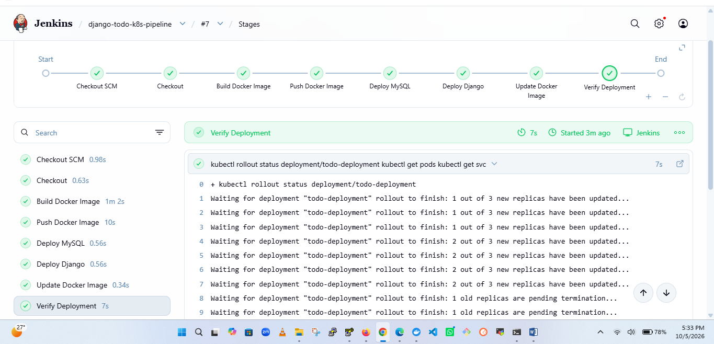
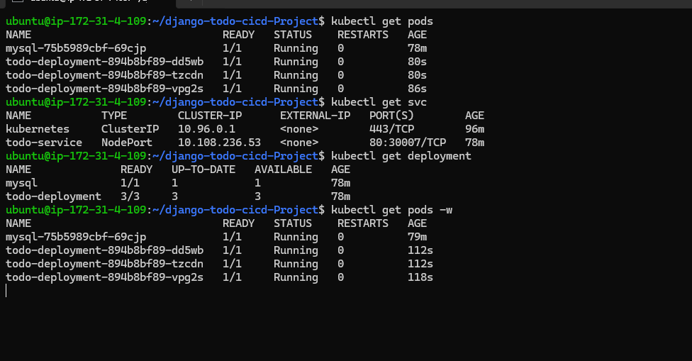

# Django Todo Application — CI/CD with Jenkins & Kubernetes
A complete DevOps CI/CD project demonstrating the automated deployment of a containerized Django Todo application with MySQL on Kubernetes.

## Application

The application is containerized using Docker and deployed on a Kubernetes cluster. Jenkins automates the complete CI/CD process whenever new code is pushed to GitHub.

## Todo Application Screenshot



## 🔄 CI/CD Automation


## ☸️ Kubernetes Deployment


## 📈 Autoscaling


Clone the repository:

```bash
git clone https://github.com/Irfan-devops1/django-todo-cicd.git
cd django-todo-cicd
```

## Jenkins Setup

Jenkins is used in this project to automate the CI/CD pipeline.

### 1. Install OpenJDK 21

Update the package repository:

```bash
sudo apt update
```

Install OpenJDK 21 and required dependencies:

```bash
sudo apt install -y fontconfig openjdk-21-jre
```

Verify the Java installation:

```bash
java --version
```

### 2. Install Jenkins — Long Term Support (LTS)

Add the Jenkins repository key:

```bash
sudo wget -O /etc/apt/keyrings/jenkins-keyring.asc \
  https://pkg.jenkins.io/debian-stable/jenkins.io-2026.key
```

Add the Jenkins LTS repository:

```bash
echo "deb [signed-by=/etc/apt/keyrings/jenkins-keyring.asc]" \
  https://pkg.jenkins.io/debian-stable binary/ | sudo tee \
  /etc/apt/sources.list.d/jenkins.list > /dev/null
```

Update the package repository:

```bash
sudo apt update
```

Install Jenkins:

```bash
sudo apt install -y jenkins
```

### 3. Start and Enable Jenkins

Start Jenkins:

```bash
sudo systemctl start jenkins
```

Enable Jenkins to start automatically after reboot:

```bash
sudo systemctl enable jenkins
```

Check Jenkins service status:

```bash
sudo systemctl status jenkins
```

### 4. Access Jenkins

After installation, Jenkins can be accessed through:

```text
http://<SERVER-IP>:8080
```

Retrieve the initial administrator password:

```bash
sudo cat /var/lib/jenkins/secrets/initialAdminPassword
```

Copy the password and enter it on the Jenkins setup page.

### Jenkins Pipeline

The Jenkins pipeline is used to automate the application build and deployment process.

Typical pipeline stages include:

1. **Checkout** – Clone the source code from GitHub.
2. **Build** – Build the application.
3. **Docker Build** – Create the Docker image.
4. **Docker Push** – Push the image to Docker Hub.
5. **Deploy** – Deploy the application to Kubernetes.
6. **Verify** – Verify that the application is running successfully.


Install Django and the required dependencies.

Create database migrations:

```bash
python manage.py makemigrations
```

Apply the migrations:

```bash
python manage.py migrate
```

Create an admin user:

```bash
python manage.py createsuperuser
```

Start the Django application:

```bash
python manage.py runserver
```

Open the application:

```text
http://127.0.0.1:8000/todos
```

## Docker

Build the Docker image:

```bash
docker build -t django-todo-app .
```

Run the application:

```bash
docker run -p 8000:8000 django-todo-app
```

Docker Compose can also be used:

```bash
docker compose up -d
```

## Kubernetes

Kubernetes deployment files are available in the `k8s/` directory.

The project includes:

* Deployment
* Pod
* Service
* MySQL Deployment
* MySQL Configuration
* MySQL Secret

Apply the Kubernetes resources:

```bash
kubectl apply -f k8s/
```

Check the resources:

```bash
kubectl get pods
kubectl get services
kubectl get deployments
```

## DevOps Implementation

This project was used to implement and practice a complete DevOps workflow including:

* Git & GitHub
* Jenkins CI/CD
* Docker
* Docker Compose
* Kubernetes
* Kubernetes deployment and services
* Containerized application deployment
* Automated build and deployment

## Project Structure

```text
django-todo-cicd/
│
├── Dockerfile
├── docker-compose.yml
├── manage.py
├── README.md
│
├── k8s/
│   ├── deployment.yaml
│   ├── pod.yaml
│   ├── service.yaml
│   └── MYSQL-DB/
│       ├── configMap.yml
│       ├── deployment.yml
│       └── secret.yml
│
├── todoApp/
│
├── todos/
│
└── staticfiles/
```

## Author

**Irfan Ahmad**

GitHub: https://github.com/Irfan-devops1

## License

This project includes the license provided with the original application. Please review `LICENSE` before redistributing or modifying the project.

